### 2025-03-9

### TIL

#### seq2seq
- 입력된 sequence(문장)을 다른 sequnce로 변환하는 모델
- 인코더 RNN과 디코더 RNN으로 구성
- 대부분이 다 인코더-디코더 구조. Transformer도 마찬가지

#### 인코더
- 입력 시퀀스를 받아들여 고정된 길이의 벡터로 변환
- 문맥 벡터(context vector)는 입력 시퀀스의 정보를 압축적으로 담고 있음

#### 디코더
- 문맥 벡터를 받아들여 출력 시퀀스를 생성
- 문맥 벡터와 이전에 생성한 출력을 기반으로 다음 출력을 생성. (현재-이전을 반영)

#### Attention 
- 문맥에 따라 집중할 단어를 결정하는 방식. 
- 문맥을 최대한 고려할 수 있는 핵심 방식.
- Attention의 유무에 따라, 시퀀스의 길이가 길 수록 성능이 달라짐.
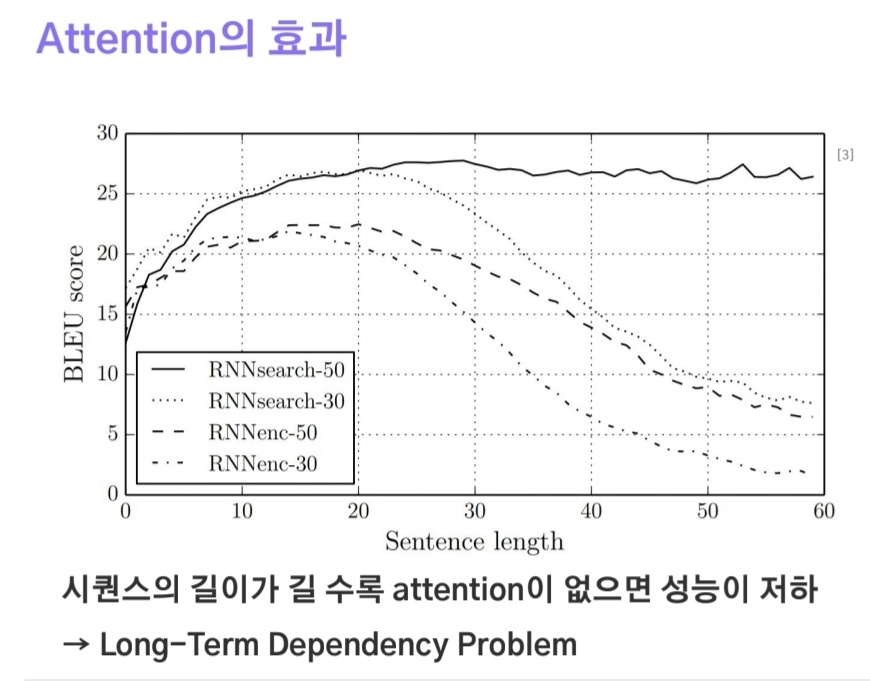
 

#### Attention Mechanimsm
- Attention은 인코더의 hidden state를 디코더로 전달 (기존의 seq2seq는 context vector만 전달)
- 각 hidden states에 점수를 계산하여, 디코더가 생성 시간 별로 집중할 부분을 찾음. (각각 다르게 context vector를 만들어서 넘겨줌)

#### Attention 이해하기
- Key = Value: 인코더의 각 hidden state
- Query: 현재 time step 시점의 디코더의 hidden state
- Attention function: Query와 Key 사이의 유사도를 계산하는 함수
- Attention Score: 각 hidden state의 중요도를 결정하는 점수
- Attention distribution: Attention scores를 Softmax 함수로 확률분포로 변환한 분포
  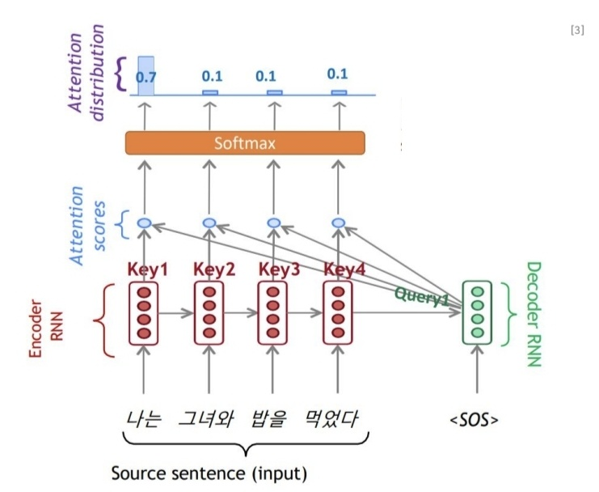

  br>
  
- Dot product attention
- Bahdanau attention (Multi-layer perceptron)

#### Attention map: 디코더의 각 시점마다 인코더의 각 단어와의 Attention score를 시각화한 것
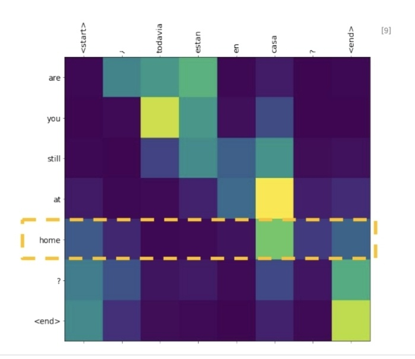
 

#### RNN with Attention
- 인코더: 모든 RNN 셀의 hidden states를 사용 (Source sequence의 모든 문맥을 활용)
- 디코더: 현재 RNN 셀의 hidden state만을 사용 (Target sequence의 문맥만을 활용)
- 디코더의 미래 입력을 반영하면 안 된다.
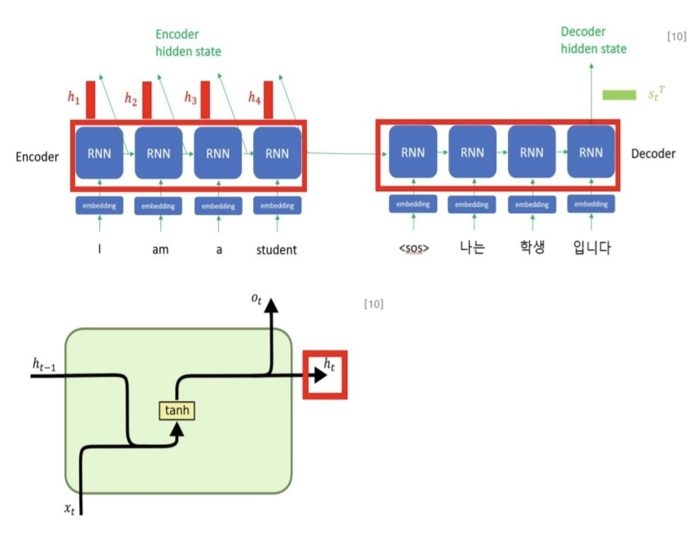
 

- 인코더 hidden states와 디코더 hidden state를 이용해 Attention score를 구함 (score1~ score4까지 4개)
- Attention score들을 softmax에 대입해 score들의 중요도의 상대성을 연산(확률화)
- 인코더 hidden states x Attention score
- 각 문맥들(hidden states)의 중요도(Attention score)를 반영하여 최종 문맥(Attention value)를 산출
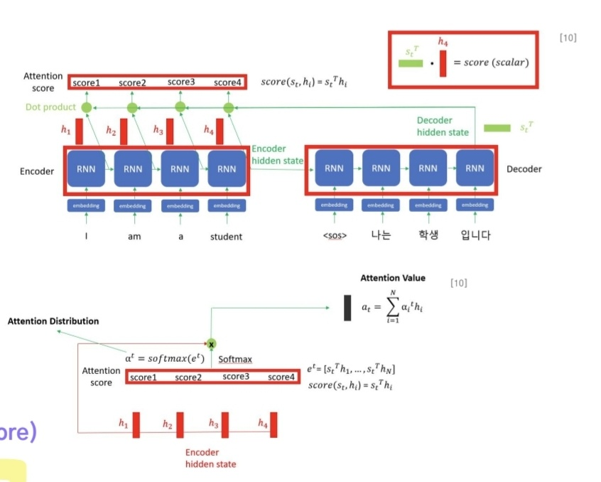
 

- Attention 모듈을 사용해 디코딩시 어떤 인코더의 토큰에 주목할지 고려
- Decorder는 디코딩 시, 매 Time-Step 별로 새로 생성될 토큰을 결정할 때, Source Sequence에서 가장 가까운 관계의 토큰을 결정하고 활용함.

 

 

## Transformer

#### Transformer 인코더
- Self-Attention
- Multi-Head Attention
- Layer Normalization
- Skip connection
- FFNN: Feed-Forward Networks

#### Transformer 디코더
- Maksed Self-Attention
- Encoder-Decorder Attention

#### Input Embeddings
- 입력 데이터를 고차원 벡터로 변환하는 과정을 의미
- 모델이 입력데이터를 처리할 수 있도록, Vocabulary를 연속적인 벡터 형태로 변환
- Input Embeddings는 학습 가능한 파라미터들로 구성

#### Positional Encoding
- 이 과정을 통해 단어의 위치 정보를 포함할 수 있음
- 모델이 문장 내에서 단어의 순서를 이해하고, 더 정확한 예측을 수행할 수 있게 됨
- 병렬적 연산 가능 (RNN의 직렬적 연산 인한 단점 극복)
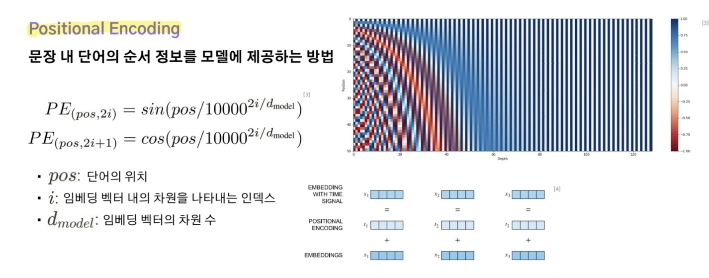
 

#### Self-Attention
- 기존 seq2seq에서 Attention(Encoder-Decoder Attention): 입력 문장과 타겟 문장 사이의 Attention Score만 계산 (디코더가 인코더의 특정 부분에 집중)
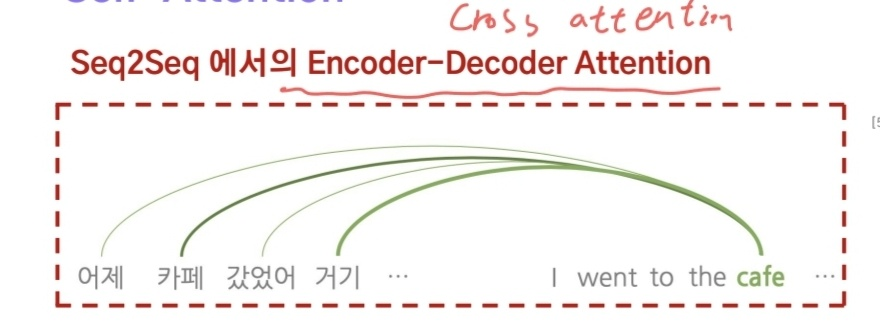
 

- Transformer의 Encoder, Decorder Self-Attention: 입력 문장 내의 토큰들의 Attention. (입력끼리, 타겟끼리 Attention)

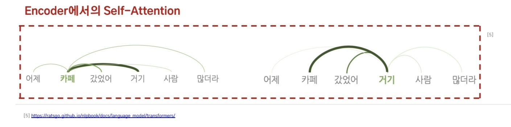
 

#### Self-Attention 과정
1. 입력을 임베딩화 (512차원)
2. 임베딩 된 벡터를 Query, Key, Value 벡터로 구성 (각각 64차원)
3. Query, Key를 Dot Product 해서 Attention Score 계산
4. Scaling 작업 진행. Attention Score에 Key 벡터사이즈 64의 제곱근으로 나누어 줌
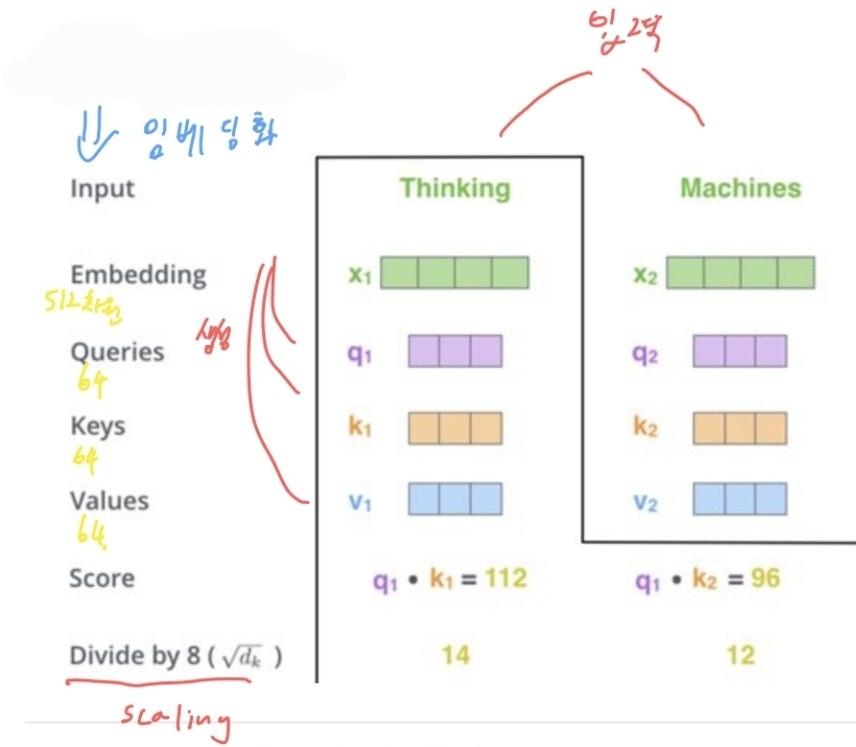
 

 

5. Softmax 진행.
6. Softmax를 통과한 확률 값을 Value 벡터의 각 우너소에 곱하여 새로운 벡터를 얻음. (지금까지의 과정: Scaled Dot Product Attention)
7. 결과로 나온 벡터를 다 더하여 Self Attention 출력을 구성

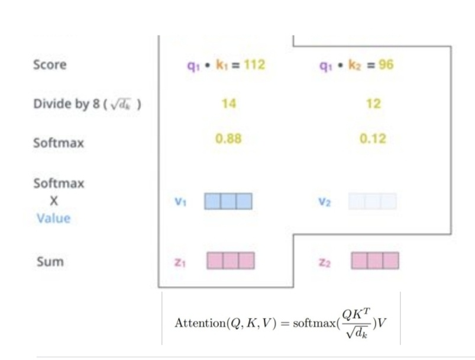

 

 

- Query = Key = Value: 현재 time step 시점의 모든 hidden states (그래서 Scaled dot-product function 사용 가능)
- 이전 매커니즘 => Key = Value: 인코더의 각 hidden state, Query: 디코더의 hidden state

 

#### Multi-Head Attention
- 여러 개의 Self-Attention을 계산해서 Concat 하고, 가중치 W를 곱한다.
- Self-Attentino 계산 과정을 8개의 다른 weight 행렬들에 대해 Head 갯수 만큼 수행
  => MultiHead(Q, K, V) = concat(head1, ..., head8)W0
- 여러 Self-Attention의 앙상블 효과를 낸다.
 
 

#### Multi-Head Attention 과정
1. 입력이 들어오면, Input Embedding, Position Encoding을 거쳐 입력벡터 계산
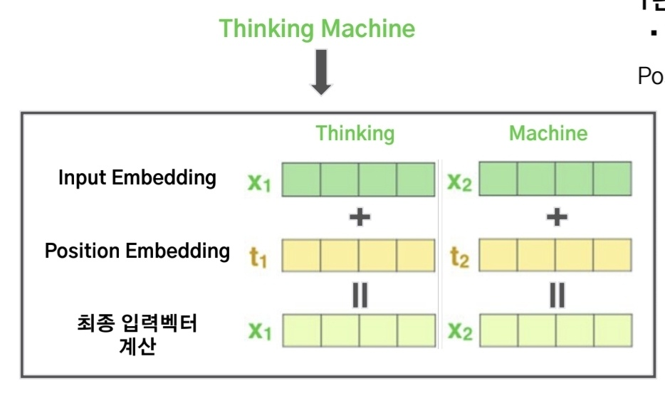
 

 

2. 입력벡터를 통해 Self-Attention을 HEAD #0 ~ #7 까지 모두 계산
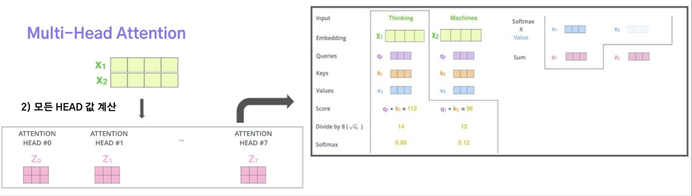
 

3. 계산된 Self-Attention 값들을 가지는 모든 HEAD들을 연결. (HEAD #0 ~ #7의 출력 Z_0 ~ Z_7 값들을 연결)

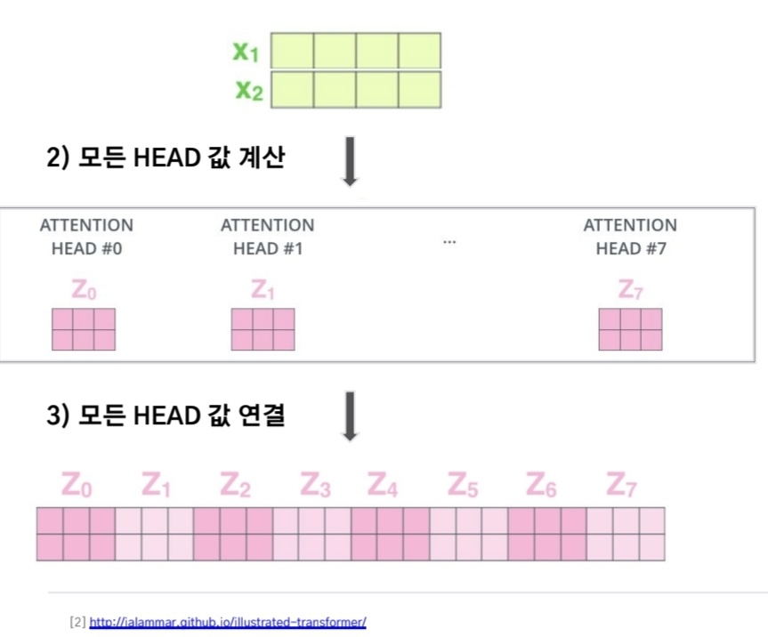  
 

4. 연결된 Z_0 ~ Z_7의 값을 최종 Output Matrix 가중치 W0와 곱하여 최종 벡터 Z를 계산
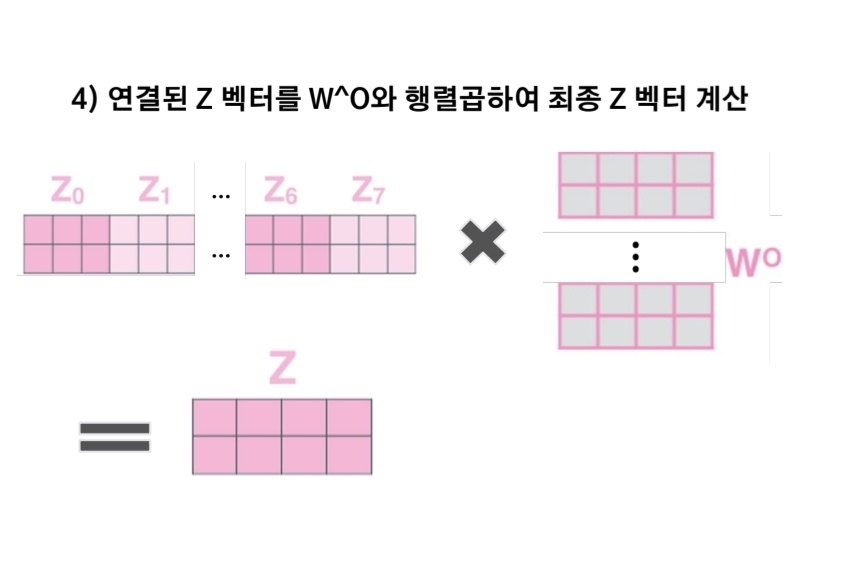
 

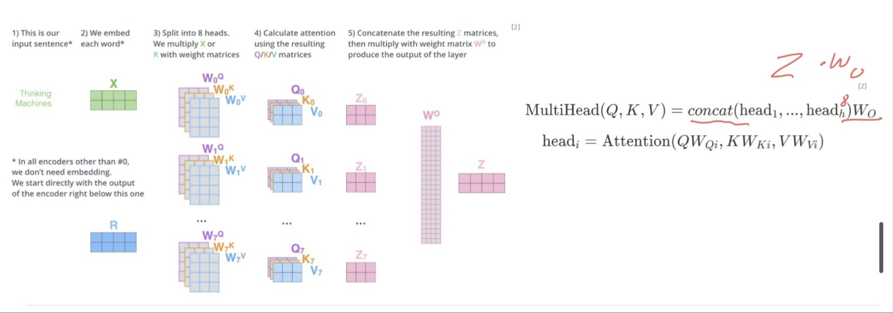
 

#### Addition 
- Addition: 두 개 이상의 텐서를 요소별로 더하는 연산.
- Transformer 모델에서는 각 계층의 입력과 출력을 더하는 Residual Connection 기법을 Addiction으로 사용함
- 모델의 깊이가 깊어질수록 발생할 수 있는 over-fitting 문제를 완화해줌
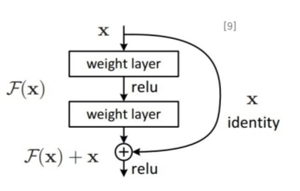
 

#### Layer Normalization
- Layer Normalization: 각 layer의 출력을 정규화하는 방법
- 각 샘플의 특성 값들을 평균 0, 분산 1로 정규화
- Transformer의 시퀀스를 입력으로 받으면 길이가 달라질 수 있어서 batch normalization을 쓸 수 없다.
- Batch Normalization은 각 batch의 데이터를 독립적으로 정규화하지만, Layer Normalization은 각 sample의 데이터값을 독립적으로 정규화한다.
- batch 크기에 의존하지 않아서, batch 크기가 작아도 잘 작동한다. (실시간, 메모리제한 시스템에 유용)
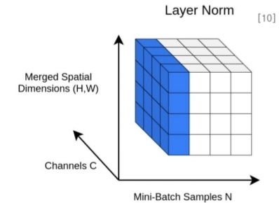
 

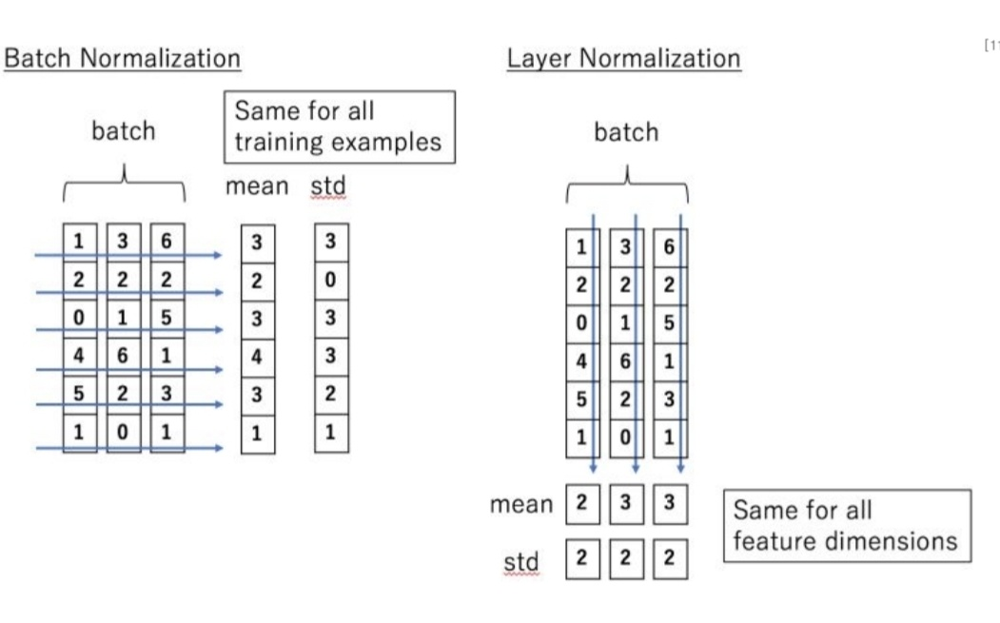
 

#### Position-wise Feed-Forward Network (FFN)
- 각 위치에서 독립적으로 동일하게 적용되는 두 개의 선형 변환으로 구성
- 모델이 각 단어를 독립적으로 처리하면서도, 전체 문장의 문맥을 고려할 수 있게 함.
 

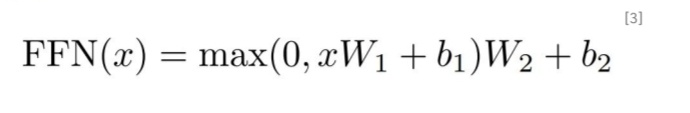
 

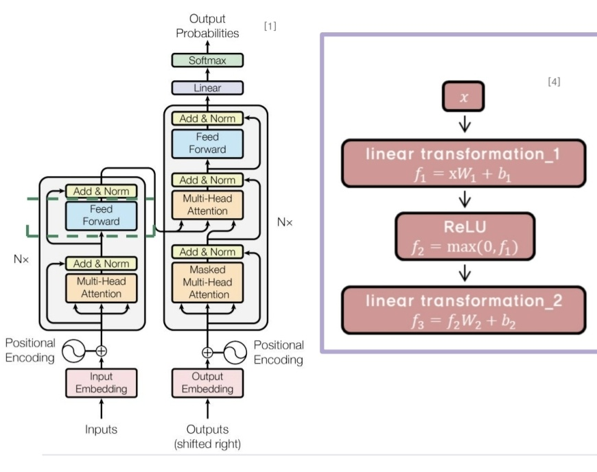
 

#### Casual Attention
- Decorder의 Attention
- Masked Self-Attention
- 입력된 토큰까지의 정보만 Attention에 반영하고, 미래의 입력은 반영하지 않음.
- 일반적인 Attention 매커니즘은 입력 시퀀스의 모든 위치에 접근하여 현재 위치의 출력을 계산할 때, 이전, 이후의 정보도 사용함
- 문장 전체의 문맥을 이해하는데 유용하지만, 실시간 처리나 예측 작업에서는 문제가 되어서 Casual Attention이 도입되었다.

 

#### Transformer의 Encoder-Decoder Attention
- Decoder가 출력 시퀀스의 각 요소를 생성할 때, 입력 시퀀스의 모든 요소를 고려할 수 있게 함.
- Decoder의 self-attenton은 현재, 이전 위치의 attention을 가지고 수행한다. Encoder와 달리 순차적으로 출력해야하기 때문.
- Decoder는 입력 시퀀스의 각 요소와의 Attention score를 계산하고, 입력 시퀀스의 가중 평균을 구함.
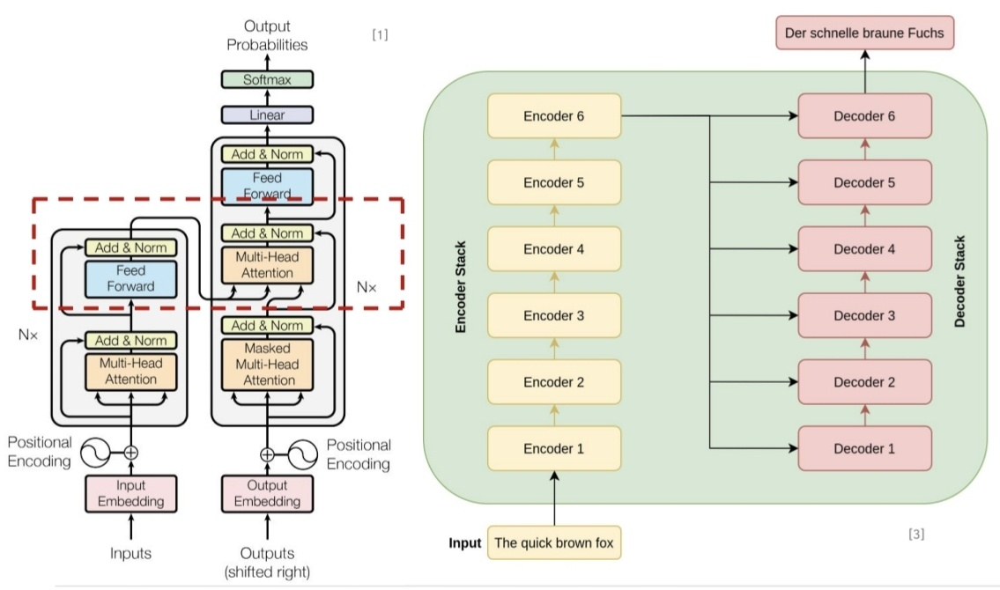
 

#### 임베딩 값을 적절한 단어(토큰)로 전환
- 최종 Decoder stack의 출력 벡터를 vocabulary 사이즈로 변환
- vocabulary 사이즈와 동일한 벡터의 사이즈로 변환하기 위해 Linear layer 사용. 변환된 값은 logits이라 함
- softmax를 통해 확률값으로 변환 후, 가장 높은 확률 값을 가지는 단어(토큰)을 다음 출력 토큰으로 생성
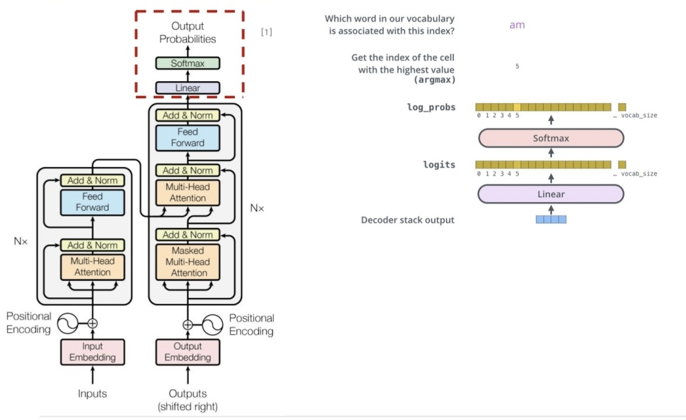
 
