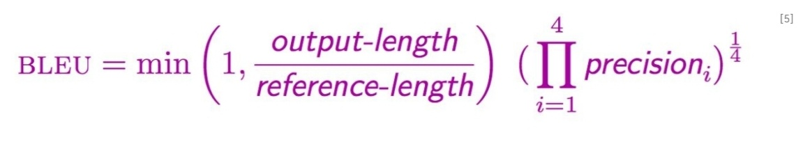

### 2025-03-11

### TIL

#### 대표적인 자연어 처리
- 기계 번역: 다양한 국가의 언어를 원하는 언어로 번역
- 질의 응답: 사용자의 질문을 이해하고, 관련 문서를 찾아 올바른 정답을 추출하거나 생성
- 정보 추출: 주어진 쿼리를 기반으로 관련 문서, 정보들을 추출
- 감성 분류: 주어진 입력 문장의 감성[ 긍정(1), 부정(0), 중립 ]을 분류
- 요약: 주어진 본문의 중요한 내용을 요약

 

#### BLEU: 기계번역이나 텍스트 생성 작업의 품질을 평가할 때 사용되는 자연어 처리 평가지표.
- 문장에 없는 단어가 오역되어 들어오면(precision이 떨어지면) 영향이 클 수 있기 때문에, precsion을 기반으로 함.
- n-gram (n= 1 ~ 4)의 n값에 따라 문장을 나눠 정답값과 얼마나 겹치는지 다각도로 평가.

   

#### Positional Encoding
- RNN, CNN에는 없고, Transformer에서 추가된 기능.
- 입력 시퀀스의 단어들이 어떤 순서로 들어왔는지에 대한 정보
- sin, cos과 같은 주기함수를 통해 주기를 갖는 값을 제공
- Input embedding 값에 Positional Encoding 값을 더해 인코더와 디코더에 입력

#### 단어 임베딩 (Word2vec, GloVe)
- 단어를 벡터로 표현하여 컴퓨터가 자연어를 이해할 수 있도록 만듦
- 단어가 어디에 나타나는지에 상관없이 동일한 벡터를 할당 받음.
- 여러 의미를 가지는 다의어에 대해 풍부한 의미를 갖지 못하고 데이터의 질이 떨어진다. (문맥으로부터 단어의 의미를 파악할 수 있는 단어 벡터가 생성되어야 함.)

#### 자연어 Transfer Learning
- 대량의 코퍼스(blog, news, wiki)를 활용하여, 특정 방식으로 모델을 미리 훈련
- 사전 학습된 모델을 문서 분류, 요약, 대화 시스템 등 다양한 task에 활용
- 학습 데이터로 레이블링 되지 않은 코퍼스를 사용하기 때문에, 학습 데이터를 제한없이 확보 가능
- Fine tunning을 통해 모델 학습이 더 빠르게 수렴하여 효율적인 학습 시간 확보 가능.

#### ELMo (Embeddings from Language Models)
- 언어 모델 기반으로 문맥 정보를 반영한 단어 임베딩
- 문장 전체를 보고, 단어 임베딩 생성
- pre-training 모델을 fine-tuning 하여 다양한 task에 적용
- (옛날 방식), 2개의 층으로 이루어진 순방향 LSTM, 역방향 LSTM을 독립적으로 학습하는 언어 모델
- 언어 모델이 각각 한쪽 방향만으로 학습하는 단점 때문에, 문맥 정보를 제대로 반영하지 못해서, BERT로 세대 교체
