### 2025-03-12

### TIL

#### Transformer의 인코더: 입력 문장 전체를 한 번에 인식하고 문맥(Context) 정보를 추출. 문장 전체를 양방향(Bidirectional)으로 참고. 
- 문장 분류, 감성 분석 task에 적합
#### Transformer의 디코더: 인코더의 출력을 참고하여 새로운 문장을 생성. Masked-Self-Attention을 쓰기에, 왼쪽부터 오른쪽으로 순차적으로 예측.
- 텍스트 생성, 번역 task에 적합

 

#### BERT (Bidirectional Encoder Representations from Transformers)
- TransFormer의 인코더만으로 구성된 언어모델 (12개, 24개의 층)
- 문장에서 무작위로 단어를 마스킹하여 양방향 단어 정보를 동시에 학습한 문맥 정보를 습득(Embedding). 문맥 이해에 강점.
- 레이블이 없는 텍스트 데이터로 pre-training, 특정 task에 적용하기 위해 FFN + Softmax로 이루어진 Classifier를 통해 fine-tuning 수행
 
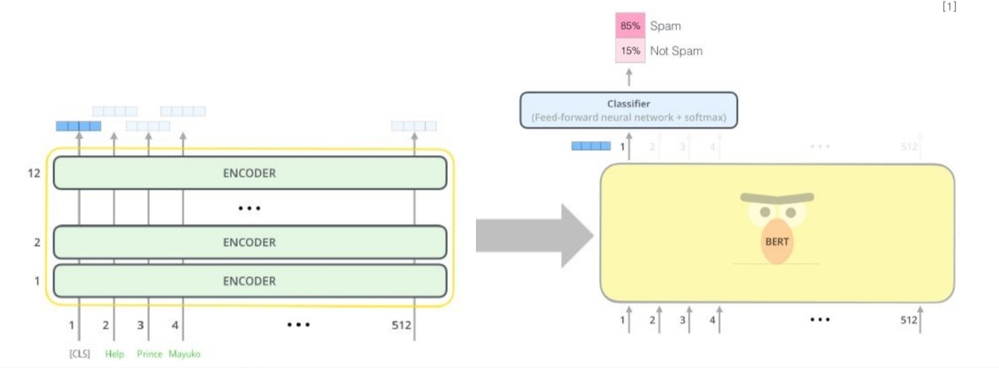
 

##### BERT 입력 임베딩
- 모든 문장의 첫번째 토큰은 항상 [CLS] 토큰.
- [SEP] 토큰은 서로 다른 문장으로 구별하기 위한 토큰. 서로 독립적인 문장으로 인식할 수 있게 해줌.
 
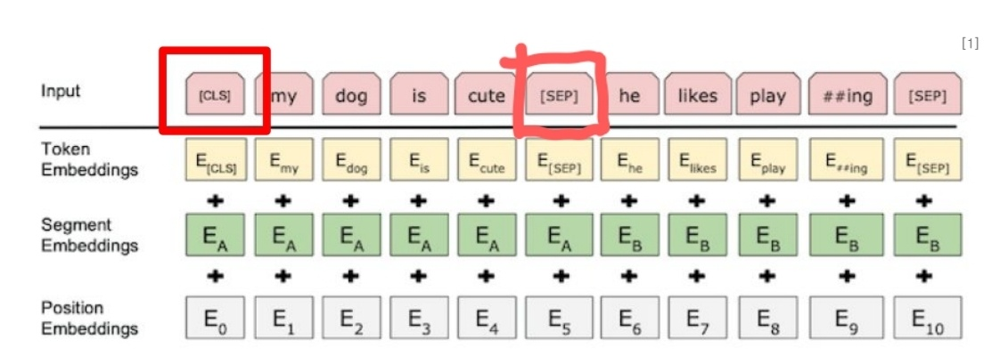
 

  
- Position Embedding: 단어의 위치 정보를 학습하기 위한 임베딩.

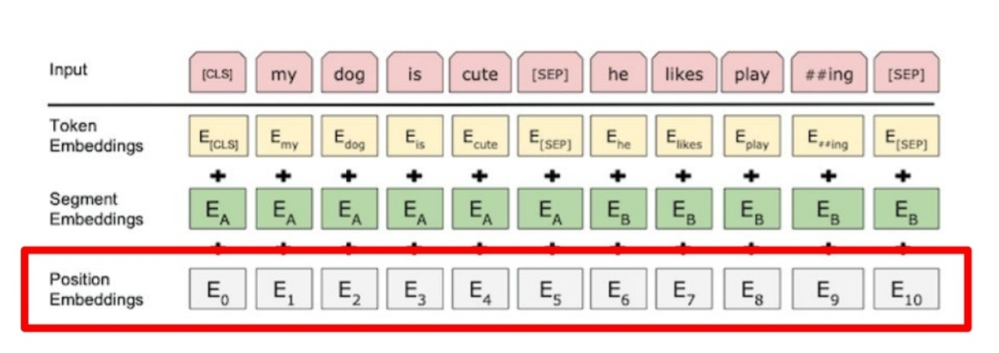
 

  
##### BERT Pretraining (더 발전된 BERT에서는 다 사라지는 기법)
- Masked Language Model (MLM): 문장 내에서 무작위로 마스킹 된 토큰을 예측하며 학습. 하지만 이것은 추론 시에는 마스킹 되지 않은 멀쩡한 문장이 오기 때문에 제대로 적용이 안 되어서 다른 기법으로 대체된다.
- 각 문장의 토큰을 [Mask]로 치환하고, 마스킹 된 토큰의 마지막 은닉 벡터를 FFN과 softmax로 구성된 classifier에 통과시켜 단어를 예측.
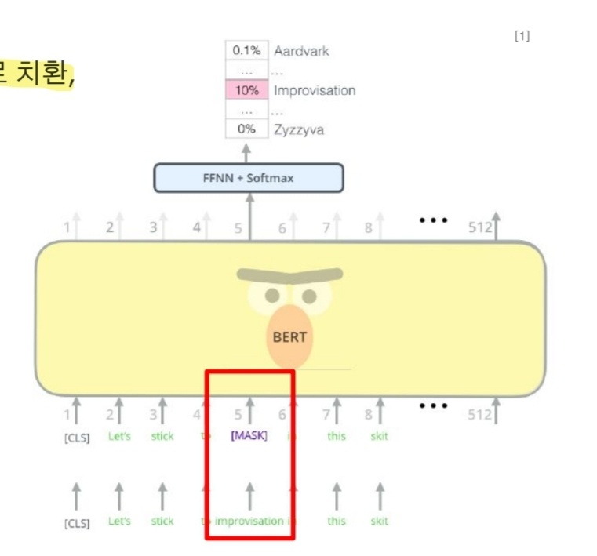
 
   

- Next Sentence Prediction (NSP): 두 개의 문장이 이어지는 문장인지 예측하며 학습. 두 문장의 관계를 잘 추론하지만, 이후에 나오는 RoBERTa에서는 오히려 성능이 떨어져서 안 쓴다.
- 문장과 문장 사이에 [SEP] 토큰을 넣어 각 문장이 다른 문장임을 알려주고, [CLS] 토큰으로 두 문장이 이어지는 문장인지 예측.
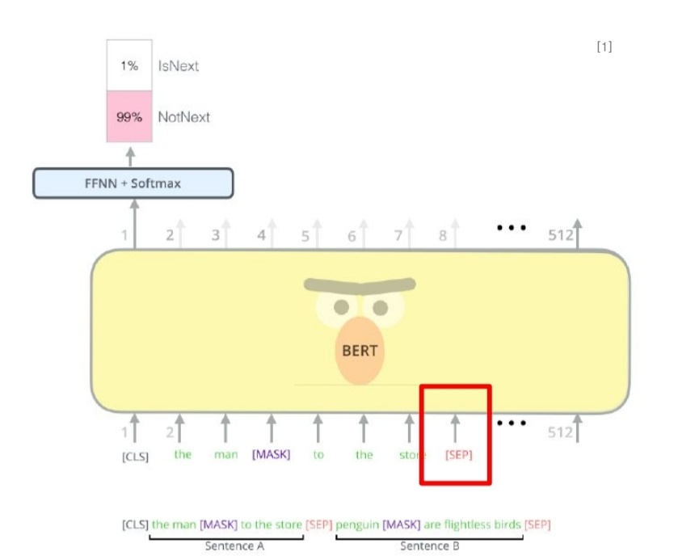
 
   

#### Pre-trained BERT는 다른 모델의 단어 임베딩용으로 활용이 가능함.
 

#### GPT (Generative Pre-Training)
- Transformer 디코더만으로 구성된 언어모델. 생섣에 강점이 있다.
- BERT의 Masked Language Modeling과 다르게, 다음 단어를 생성하는 방식으로 Pre-training (Causal Language Modeling)
- 디코더로 이루어져있어, 앞의 문맥이 주어졌을 때 다음으로 오는 단어를 맞추는 방식으로 학습한다. (단방향)
- 각 Layer마다 Masked Multi-Headed Self-Attention을 활용해 예측하는 단어의 앞 단어만 반영해서 예측한다.

 ##### GPT Pre-training
 - Causal Language Modeling: 왼쪽에서 오른쪽으로 예측하며 학습.
 - N개의 단어로 이루어진 문장으로, N+1개의 사전 학습 데이터 생성.
 - 문장의 시작 [sos], 문장의 끝 [eos] 토큰을 사용.
 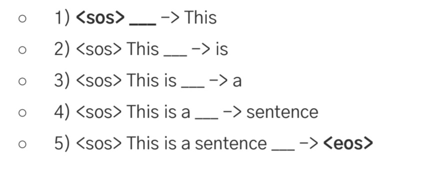
 
   

 

#### GPT-2, GPT-3
- GPT-1 에서 더 많은 Layer, 더 많은 데이터를 사용해 Pre-trained 된 모델
- Fine-tuning이 아니라 몇 개의 예제를 입력하는 Few-shot, One-shot, Zero-shot 기법을 사용.
- 모델 사이즈(Scale)이 커지면 성능이 올라간다는 Scailing Laws의 대표주자.

#### Few-shot
- Fine-tuning과 달리 많은 수의 labeling 데이터가 필요하지 않다.
- 별다른 학습없이 예제를 입력하는 것만으로 성능 향상.
- 고점은 Fine-tuning보다 낮지만, 편리하고 성능이 낮은 편도 아니다.
- 이럼에도 불구하고 GPT는 규모가 커서 추론을 수행하기에는 비용이 많이 든다는 단점이 있음.

 
 

#### Encoder-Decoder
- Transformer의 구조랑 유사
- Seq2seq task에 특화 (요약, 번역)
- source 문장과 target 문장의 길이가 달라도 잘 반영된다.
 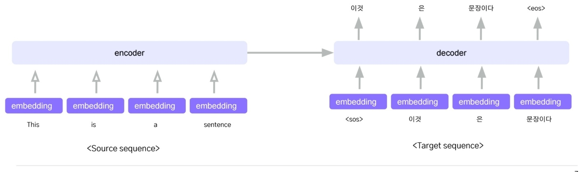
 
 

#### BART
- Encoder-Decoder 구조의 모델
- 생성 task에서 Fine-tuning 할 때 효과적
- 임의로 Noise를 5개의 방식으로 추가하여 원본 문장을 손상시키고 복원시킴으로써 Pretraining 진행 (Diffusion Model..?)
- 기계번역에서는 Pre-training 하지 않은 언어도 번역할 수 있도록 Randomly Initialized Encoder를 추가하는 방식 제시
 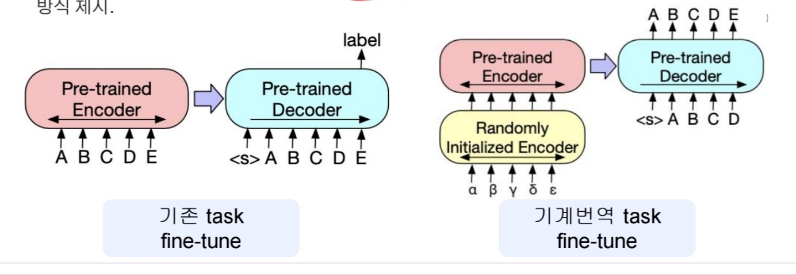
 
 

##### BART Noise
- 입력 문장에 Noise 추가
1. Token Masking: BERT처럼 임의의 token을 샘플링 하여 [MASK] 토큰으로 대체한 문장을 Encoder에 입력
 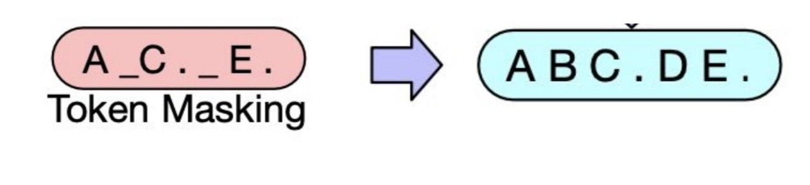
 
 

2. Token Deletion: 임의의 token을 원본 문장에서 삭제한 뒤에 Encoder에 입력
 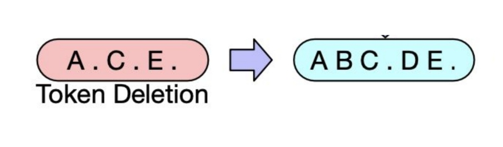
 
 

3. Text Infilling: 연속된 0~N개의 token들을 마스킹 한 뒤 Encoder에 입력 (Token Masking의 확장판)
 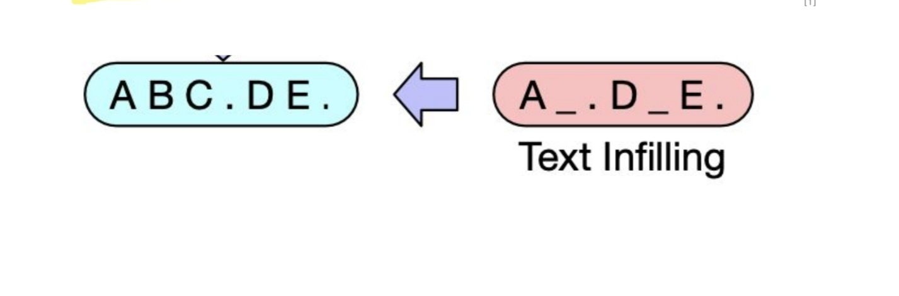
 
 
 
4. Sentence Permutation: 문서를 마침표(.)을 기준으로 여러 문장들로 나누고, 임의의 순서로 섞은 뒤, Encoder에 입력.
 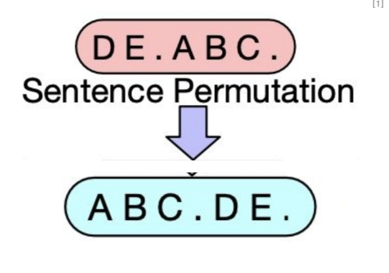
 
 

5. Document Rotation: 전체 문서에서 임의로 선택된 token이 시작 token이 되도록 회전한 문장을 Encoder에 입력
 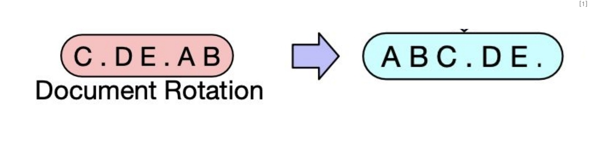
 
 

- 5개의 Noise 추가 방식 중, 전반적으로 Text-Infilling이 가장 효과적
- Token Deletion 또는 Masking 사용 시 성능 향상
- Token Deletion은 생성 Task(요약, 질의응답)에서 Masking, Infilling을 능가.
 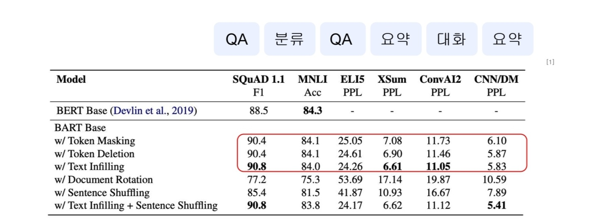
 
 

- 다중 문장 Task에서는 Text-Infilling과 Sentence Shuffling(Permutation)을 결합하는 방식이 가장 좋은 성능.
- 거의 모든 작업에서 Text-Infilling을 사용하는 BART 모델이 좋은 성과를 보임.
- Document Rotation, Sentence Shuffling(Permutation)은 단독으로 사용했을 때 효과가 적음.
 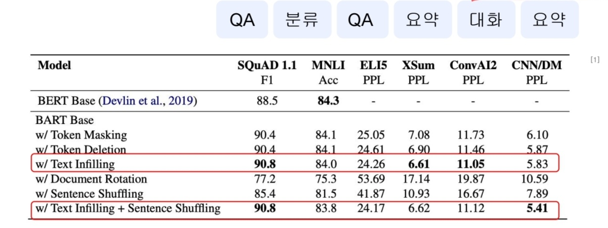
 
 

## BERT 이후의 모델
- BERT의 Masked Language Modeling (MLM)은 성능이 별로라서 방식을 바꾼다는 내용
- Next Sentence Prediction (NSP)도 오히려 별로라고 까인다.
   
  
- Masked Language Model (MLM): 문장 내에서 무작위로 마스킹 된 토큰을 예측하며 학습
- Next Sentence Prediction (NSP): 두 개의 문장이 이어지는 문장인지 예측하며 학습.

#### RoBERTa
- MLM을 Dynamic masking 방법으로 교체
- NSP 제거
- 더 많은 학습데이터 + 더 큰 batch 크기로 학습

##### Dynamic masking
- MLM은 입력 데이터 전처리 단계에서 마스킹 작업이 한번만 수행되고 학습 동안 매 epoch마다 같은 곳만 마스킹된 sequence를 보게 되어 overfitting이 일어날 수 있음.
- Dynamic masking은 전처리 단계에서 마스킹 작업을 하지 않고, 모델에 입력할 때마다 마스킹 작업을 수행하여 매 epoch마다 새로운 마스킹 패턴이 나오게 함. (K-fold Cross Validation과 유사)
 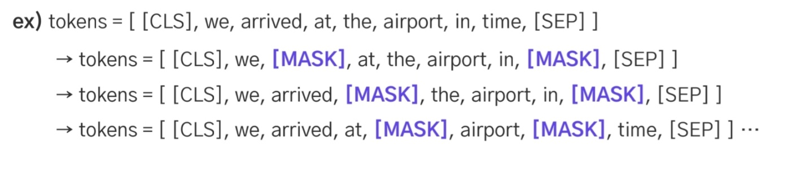
 
 

예측해야할 단어들이 많아져서 학습 내용이 다양해지고, 기존 BERT 방식보다 성능이 향상됨.

##### NSP 제거: NSP를 수행하지 않고 학습하니 오히려 성능이 향상됨.
##### 더 많은 데이터: 성능 향상
##### 더 큰 batch 크기: Batch 크기를 키우면 학습 시 복잡도도 낮아지고 성능 향상에 도움이 됨

 

#### SpanBERT
- Span masking을 통해 개별 token을 마스킹 하지않고, 연속적인 span을 마스킹 함 (Text Infilling과 유사)
- 마찬가지로 NSP 사용 안 함
- 질의응답 같은 task에서 성능 향상
 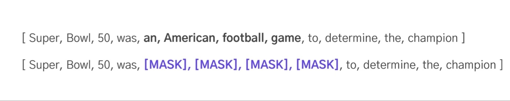
 
 

##### Span Masking
- 여러 단어에 걸쳐있는 연속적인 span에 무작위로 마스킹 처리
- 연속적인 [MASK] 토큰의 예측을 위해 일련의 [MASK] 토큰 양쪽 경계에 있는 문자 토큰의 임베딩 값을 예측에 활용
- 추가적으로 span 내부의 토큰들을 구분하기 위해 [MASK] 토큰의 Position Embedding 부여
 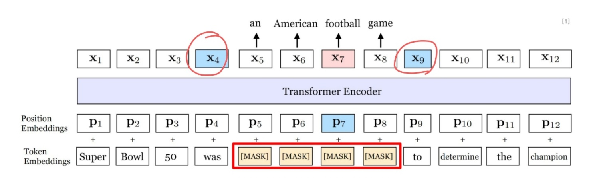
 
 

- 기존 BERT의 MLM loss처럼 SBO loss를 합하여 학습에 사용
- Span boundary token(x4, x9)의 임베딩 값을 사용하여 전체 masked span을 예측하기 때문에 학습 시 span 전체의 정보가 많이 포함됨
 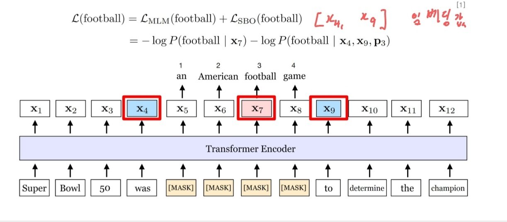
 
 

#### ELECTRA
- MLM 대신 Replaced Token Detection (RTD) 사용
- Generator가 마스킹된 단어에 대해 단어를 생성하면, discriminator (ELECTRA)는 해당 단어가 가짜인지 판별 (GAN의 방식)

##### Replaced Token Detection (RTD)
- 기존 MLM은 loss 값이 계산이 잘 안 되서 학습의 효율도 떨어지고 추론할 때는 [MASK] 토큰이 없어서 별로임
- ELECTRA에서는 입력 토큰 전체에서 loss를 계산하기 위한 방법을 제안
- Generator를 이용해 실제 입력의 일부 토큰을 가짜 토큰으로 바꾸고, discriminator가 판별하는 이진 분류 문제를 통해 모델 pre-training 수행
- 입력 문장을 부분적으로 단어가 바뀌 여러 문장으로 생성 가능
- Discriminator가 모든 토큰에 대해 판별을 해야해서 모든 토큰에 대해 학습 가능. (토큰 전체에서 loss 계산)
 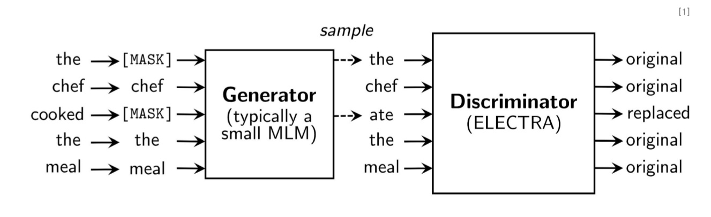
 
 

##### Generator, Discriminator: 둘 다 Transformer의 인코더 구조.

##### 작은 크기로 줄인 ELECTRA-Small이 BERT_Small 보다 높은 성능을 냄.

 

#### ALBERT
- 모델 경량화를 위한 파라미터 수 축소
- Input token embedding의 사이즈를 줄여서 파라미터를 줄임
- Transformer layer 간의 같은 파라미터를 공유하여 파라미터를 줄임
- NSP 안 쓰고, SOP (Sentence order prediction) 학습

##### Factorized Embedding Parameterization
- 기존 BERT에서는 Input token embedding 크기 (E)와 Transformer layer의 hidden layer의 크기 (H)가 같음
- Transformer는 정보량이 많은 문맥 정보를 담아야해서 hidden size가 커야하지만 input token embedding은 각 token에 대한 정보만 담으면 되서 클 필요가 없음.
- matrix factorization (행렬 분해)을 통해 input token embedding 크기 (E)를 줄임.
- 그 결과, 파라미터 수가 줄고 학습 속도 상승
 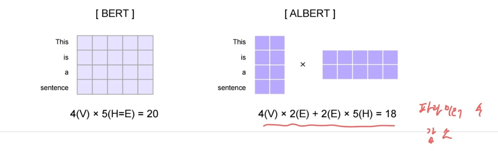
 

##### Cross-layer parameter sharing
- Transformer의 각 layer에 포함된 학습 파라미터를 모든 layer에 공유 (multi-head Attention: W_Q, W_K, W_v 공유, FFN 가중치 공유)
- 그 결과, 성능이 크게 안 떨어지며 전체 모델의 크기가 크게 감소

##### SOP
- NSP는 첫 문장과 비교할 문장을 임의로 뽑았기 때문에 비교적 쉬운 topic prediction에 가까움.
- SOP는 비교할 문장을 무작위로 가져오지 않고, 실제 연속된 문장을 가져와 순서를 변경하여 원래의 순서를 예측하는 task로 변경됨.
- SOP로 학습 시, NSP도 가능. 그 반대로 NSP로 학습한건 SOP 불가능.
- SOP 적용 시 task 성능 향상

 

#### DistilBERT
- Pre-trained 모델(teacher)을 기반으로 소규모 BERT 모델(student) 학습
- 학습된 모델인 teacher 모델에 마스킹 된 문장을 입력하여 출력된 단어 확률 분포 정보를 student 모델 학습에 사용 (soft label로 공유, 전이학습)
- 기존 BERT 대비 모델 사이즈를 40% 수준으로 줄이고, 97% 수준의 성능을 유지하며 60% 가량 빠른 학습 속도를 보임.
 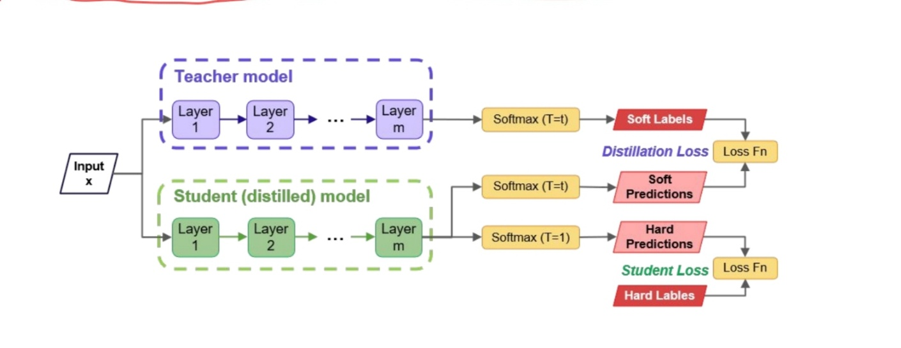
 
 
 

 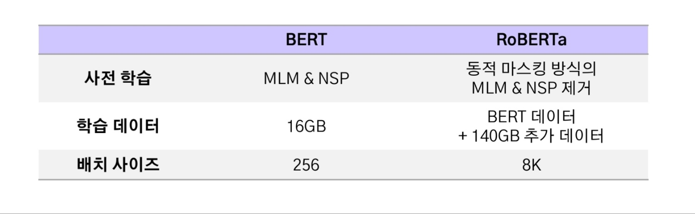
 
 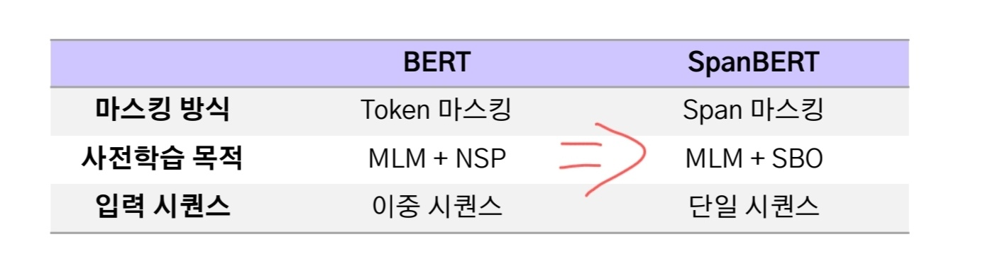
 
 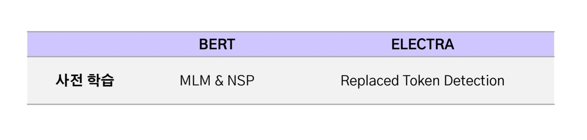
 
 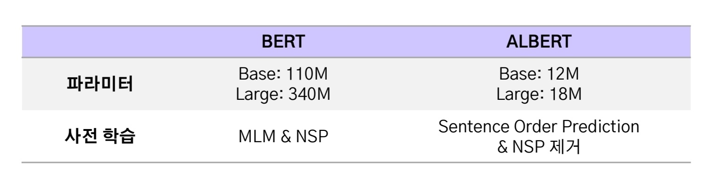
 
 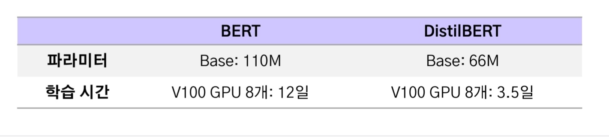
 
 

 

 
 
 
 
 
 